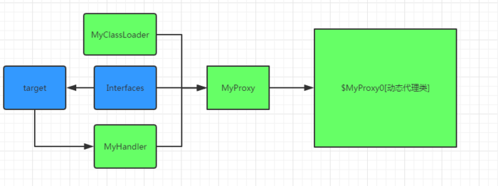
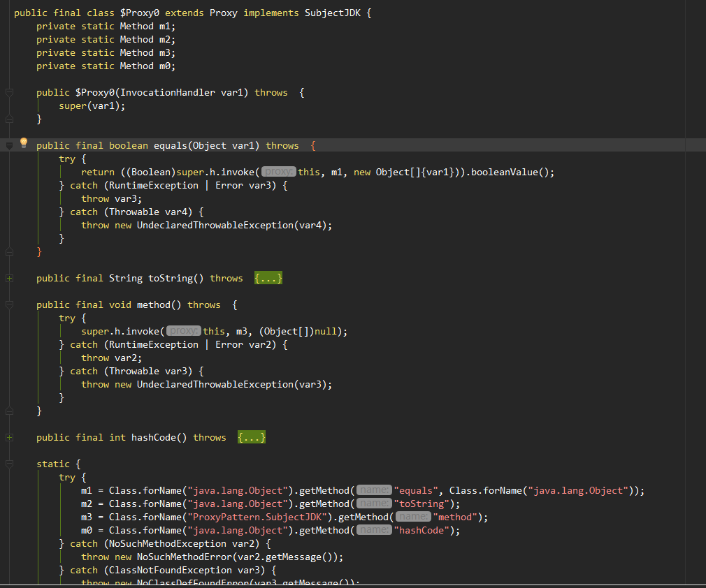

静态代理

动态代理
动态代理的实现有两种方式，一种通过实现接口，也就是JDK动态代理采用的方法，一种以子类继承的方式，就是CGLIB使用的方法

**JDK 动态代理**

通过被代理的实际对象的接口和classloader动态创建一个代理对象

大致步骤：
1. 定义委托类即需要被代理的类和公共接口
2. 自定义类实现InvocationHandler接口，指定生成的代理类的动作，也就是代理调用任何方法都会经过这个方法
3. 生成代理类和代理对象，通过Proxy.newProxyInstance()指定classLoder，接口数组，InvocationHandler实现类

生成的代理类：
+ 继承了Proxy类，并实现了接口数组
+ public final
+ $proxyN命名
+ 有个参数为InvocationHandler的构造函数，从实现中可以看到

缺点：
只能针对接口创建代理类

通过解析生成的$Proxy0.class文件可以发现
$Proxy0继承了Proxy类，并且实现了所有的接口数组里的接口，然后重写这些方法，拿到targetObject对象，通过反射获取接口中的method，
然后执行InvocationHandler的invoke方法，通过method.invoke方法反射调用，达到代理的目的。

**自己实现JDK动态代理**

**CGLIB**
上面的静态代理和动态代理
